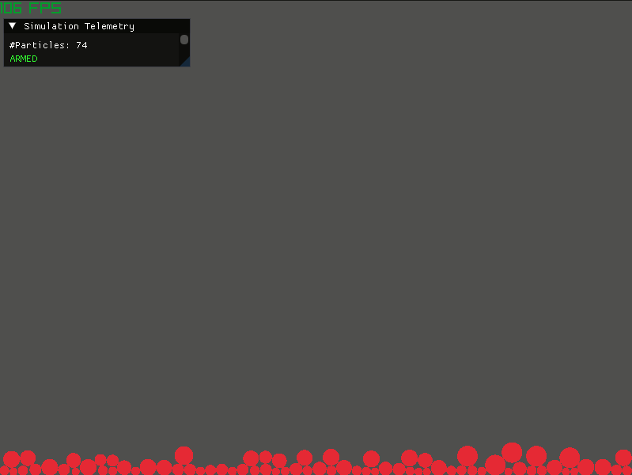

# Simple Bouncing Balls Simulation


A 2D ridgid-body physics simulation built to explore and refresh modern C++ concepts. It simulates particles with spatial extent and mass using physics-based conservation of momentung and energy.

---

## 🧮 The Simulation


---

## Features so far
* **Accurate 2D Physics:** Gravity, wall collisions, particle collisions, superposition resolution (mass based)
* **Event-Driven Inputs:** Lambda-based input handler

## 🚀 Getting Started

### Prerequisites
* CMAKE 3.15 or higher
* A C++20 compatible compiler (GCC, Clang, ...)

### Build Instructions
1. **Clone Repository:**
```bash
   git clone https://github.com/derpadi/2D_ParticleSimulator.git
   cd 2D_ParticleSimulator
```

2. **Generate the build files and compile:**
```bash
mkdir build
cd build
cmake ..
cmake --build .
```
Note: It might take some while to download dependencies!

3. **Run the simulation:**
* **Linux / macOS:** `./2D_ParticleSimulation`
* **Windows**: `.\2D_ParticleSimulation.exe`

---

## 🎮 Controls
| Input | Action |
| :--- | :--- |
| **Left Click** | Spawn a ball at mouse position |
| **Spacebar** | Instantly spawn 10 balls at random locations |

---

## 🏗️ Project Architecture

```text
2D_particleSimulation/
├── include/
│   ├── Application.h              # Main engine loop and UI rendering
│   ├── BoundingBallsSimulation.h  # Physics
│   ├── Ball2D.h                   # Entity data and movement math
│   └── InputHandler.h             # Input handling logic
├── src/                           
└── CMakeLists.txt                 
```
